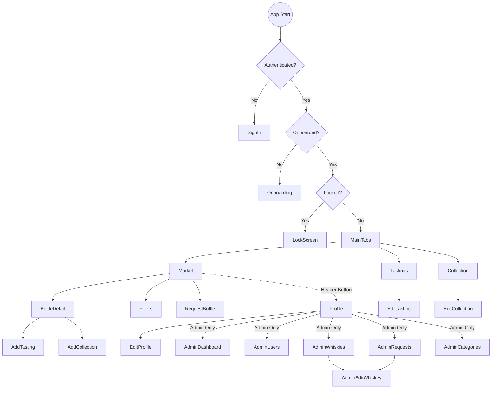

# Whisk — React Native App Architecture Guide

מסמך הכנה להצגת הפרויקט בשיעור — מתמקד בצד ה-React Native (תיקיית `mobile/`)

---

## 1. סקירה כללית של האפליקציה

**Whisk** היא אפליקציית ויסקי לאנשים שאוהבים לאסוף, לטעום ולדרג בקבוקי ויסקי. נבנתה ב-React Native עם Expo.

### מה האפליקציה עושה
- **שוק (Market)** — גלישה וחיפוש בקטלוג של עשרות בקבוקי ויסקי עם מחירים, פרופיל טעם, ודירוג התאמה אישית
- **טעימות (Tastings)** — הוספת דירוגי טעימה אישיים (גוף, עשן, מתיקות, אלכוהול) ובניית פרופיל טעם
- **אוסף (Collection)** — ניהול אוסף הבקבוקים האישי, מעקב מחירים ורווח/הפסד
- **המלצות** — לאחר 3 טעימות לפחות, המערכת ממליצה על בקבוקים שמתאימים לטעם שלך
- **פרופיל** — ניהול פרופיל, הגדרות ביומטריה, סאונד והפטיק
- **אדמין** — ממשק ניהול למשתמשי Admin לניהול ויסקי, קטגוריות, משתמשים ובקשות

### תפקידי משתמש
| תפקיד | מה הוא יכול |
|--------|-------------|
| **User** | גלישה בשוק, טעימות, אוסף, המלצות, בקשת בקבוק חדש |
| **Admin** | כל הנ"ל + דשבורד אדמין, ניהול משתמשים, ויסקי, קטגוריות, אישור/דחיית בקשות |

### תהליכים עיקריים (Main Flows)
1. **Login** → בדיקת Onboarding → Main Tabs
2. **חיפוש ויסקי** → פרטי בקבוק → הוספת טעימה / הוספה לאוסף
3. **טעימה** → דירוג 4 פרמטרים → שמירה → חישוב התאמה אחוזית
4. **המלצות** — נפתח אחרי 3 טעימות, מוצג כרשימה אופקית ב-Market
5. **Admin** — פרופיל → Admin Area → ניהול ויסקי / בקשות / קטגוריות

---

## 2. מבנה התיקיות והקבצים

```
mobile/
├── App.js                      ← נקודת כניסה, QueryClientProvider + AppNavigator
├── index.js                    ← registerRootComponent (Expo)
├── app.json                    ← הגדרות Expo (שם, אייקון, plugins)
├── package.json                ← תלויות: React 19, Expo 54, React Navigation 7, TanStack Query 5, Zustand, Axios
└── src/
    ├── navigation/
    │   └── AppNavigator.js     ← כל ה-navigation: Stack + Tabs + auth flow + biometrics
    ├── screens/                ← 19 מסכים
    │   ├── auth/               ← SignInScreen, OnboardingScreen
    │   ├── market/             ← MarketScreen, BottleDetailScreen, FilterScreen, RequestBottleScreen
    │   ├── tastings/           ← TastingsScreen, AddTastingScreen, EditTastingScreen
    │   ├── collection/         ← CollectionScreen, AddCollectionScreen, EditCollectionScreen
    │   ├── profile/            ← ProfileScreen, EditProfileScreen
    │   └── admin/              ← AdminDashboard, AdminUsers, AdminWhiskies, AdminEditWhiskey, AdminRequests, AdminCategories
    ├── components/             ← 11 קומפוננטות שימושיות חוזרות
    │   ├── Button.js           ← כפתור עם variants (primary/secondary/outline/danger) ו-loading
    │   ├── Card.js             ← מעטפת כרטיס עם onPress אופציונלי
    │   ├── Input.js            ← שדה קלט עם label + error
    │   ├── WhiskeyCard.js      ← כרטיס ויסקי בשוק (React.memo לביצועים)
    │   ├── DeltaSlider.js      ← סליידר -5 עד +5 לדירוג טעימות
    │   ├── MatchBadge.js       ← תג אחוז התאמה בצבעים (ירוק/כתום/אדום)
    │   ├── StatusChip.js       ← תג סטטוס צבעוני (Closed/Opened/Finished)
    │   ├── BarrelLevel.js      ← רמת חבית ויזואלית (5 חביות)
    │   ├── EmptyState.js       ← הודעת "אין תוצאות" עם אייקון
    │   ├── LoadingScreen.js    ← מסך טעינה עם ActivityIndicator
    │   └── LockScreen.js       ← מסך נעילה ביומטרי
    ├── api/                    ← 9 קבצי API
    │   ├── client.js           ← axios instance (baseURL, token interceptor, 401 logout)
    │   ├── auth.js             ← login/dev-login (fetch), getMe (axios)
    │   ├── whiskies.js         ← GET whiskies + categories
    │   ├── collection.js       ← CRUD collection
    │   ├── tastings.js         ← CRUD tastings
    │   ├── profile.js          ← GET/PUT profile, onboarding, delete
    │   ├── recommendations.js  ← GET recommendations + status
    │   ├── requests.js         ← POST/GET bottle requests
    │   └── admin.js            ← Admin CRUD endpoints
    ├── hooks/                  ← Custom hooks
    │   ├── useApi.js           ← useQuery/useMutation wrappers לכל ה-API — 20+ hooks
    │   ├── useBiometrics.js    ← ניהול נעילה ביומטרית (AppState, SecureStore)
    │   └── BiometricsContext.js← React Context לשיתוף biometrics settings
    ├── store/                  ← Zustand stores
    │   ├── authStore.js        ← token, user, isAuthenticated (SecureStore)
    │   └── feedbackStore.js    ← soundEnabled, hapticEnabled (SecureStore)
    ├── constants/
    │   └── index.js            ← API_URL, BASE_URL, קבועים (COUNTRIES, CATEGORIES, STATUS_COLORS)
    ├── theme/
    │   └── index.js            ← colors, spacing, borderRadius, typography, shadows
    └── utils/
        ├── feedback.js         ← useFeedback hook — סאונד (expo-audio) + הפטיק (expo-haptics)
        ├── notifications.js    ← push notifications registration (expo-notifications)
        └── biometrics.js       ← פונקציות עזר ל-expo-local-authentication
```

---

## 3. מפת מסכים (Screens Map)

| # | מסך | קובץ | תפקיד | קונספטים של React |
|---|------|-------|--------|-------------------|
| 1 | **SignIn** | `screens/auth/SignInScreen.js` | מסך התחברות: Email login, Dev login, כפתורי Google/Apple | `useState` x4, `async/await`, conditional rendering (`__DEV__`, `Platform.OS`), props to Button |
| 2 | **Onboarding** | `screens/auth/OnboardingScreen.js` | השלמת פרופיל ראשונית: nickname, country, תנאים | `useState` x5, `Switch` component, form validation, API call |
| 3 | **Market** | `screens/market/MarketScreen.js` | מסך ראשי — רשימת ויסקי, חיפוש, סינון, מיון, המלצות | `useState` x5, `useRef` x2, `useEffect`, `useMemo` x2, `useCallback` x4, `FlatList`, `React.memo`, infinite scroll, pull-to-refresh |
| 4 | **BottleDetail** | `screens/market/BottleDetailScreen.js` | פרטי בקבוק: תמונה, מידע, פרופיל טעם, מחיר | `route.params`, custom `ProfileBar` component, conditional loading |
| 5 | **Filter** | `screens/market/FilterScreen.js` | מודאל סינון לפי קטגוריה, מדינה, טווח מחירים | `useState` x4, `route.params` callback |
| 6 | **RequestBottle** | `screens/market/RequestBottleScreen.js` | בקשה להוסיף בקבוק חדש לקטלוג | `useState` x3, `useMutation` |
| 7 | **Tastings** | `screens/tastings/TastingsScreen.js` | רשימת הטעימות שלי | `useQuery`, `FlatList`, conditional banner |
| 8 | **AddTasting** | `screens/tastings/AddTastingScreen.js` | הוספת טעימה עם 4 סליידרים + הערות | `useState` x6, `DeltaSlider` props, `useMutation`, `useFeedback` |
| 9 | **EditTasting** | `screens/tastings/EditTastingScreen.js` | עריכה/מחיקת טעימה קיימת | `useState` from route.params, update + delete mutations |
| 10 | **Collection** | `screens/collection/CollectionScreen.js` | אוסף הבקבוקים שלי עם סיכום | `useQuery` x2, `FlatList`, `BarrelLevel`, `StatusChip`, pull-to-refresh |
| 11 | **AddCollection** | `screens/collection/AddCollectionScreen.js` | הוספת בקבוק לאוסף | `useState` x3, status buttons, `useMutation` |
| 12 | **EditCollection** | `screens/collection/EditCollectionScreen.js` | עריכה/מחיקת פריט באוסף | `useState` x3, update + delete mutations, Alert confirm |
| 13 | **Profile** | `screens/profile/ProfileScreen.js` | פרופיל + הגדרות + Admin area | `useQuery` x2, Zustand stores x2, Context, `Switch`, conditional admin section |
| 14 | **EditProfile** | `screens/profile/EditProfileScreen.js` | עריכת שם ומדינה | `useState` x2, `useMutation` |
| 15 | **AdminDashboard** | `screens/admin/AdminDashboardScreen.js` | סטטיסטיקות כלליות (משתמשים, ויסקי, בקשות) | `useQuery` |
| 16 | **AdminUsers** | `screens/admin/AdminUsersScreen.js` | ניהול משתמשים, שינוי סטטוס/תפקיד | `useQuery`, `useQueryClient`, invalidation |
| 17 | **AdminWhiskies** | `screens/admin/AdminWhiskiesScreen.js` | ניהול ויסקי, חיפוש, מחיקה | `useState`, `useMemo`, `useQueryClient` |
| 18 | **AdminEditWhiskey** | `screens/admin/AdminEditWhiskeyScreen.js` | יצירה/עריכה של ויסקי + העלאת תמונה | `useState` (form object), `ImagePicker`, `useFeedback`, large form |
| 19 | **AdminRequests** | `screens/admin/AdminRequestsScreen.js` | אישור/דחיית בקשות בקבוקים | `useQuery`, dual approve flow (existing vs create new) |
| 20 | **AdminCategories** | `screens/admin/AdminCategoriesScreen.js` | ניהול קטגוריות | `useState`, create + delete |

---

## 4. מפת ניווט (Navigation Map)

### מבנה כללי

```
NavigationContainer
└── Stack.Navigator
    ├── [לא מחובר] SignIn
    ├── [מחובר, לא onboarded] Onboarding
    └── [מחובר + onboarded]
        ├── Main (Tab.Navigator)
        │   ├── Tab: Market  ──────→ BottleDetail, Filters (modal), RequestBottle
        │   ├── Tab: Tastings ─────→ AddTasting, EditTasting
        │   └── Tab: Collection ───→ AddCollection, EditCollection
        ├── Profile ───────────────→ EditProfile
        └── Admin (from Profile)
            ├── AdminDashboard
            ├── AdminUsers
            ├── AdminWhiskies ─────→ AdminEditWhiskey
            ├── AdminRequests ─────→ AdminEditWhiskey (with prefill)
            └── AdminCategories
```

### איך זה עובד
- **`AppNavigator.js`** מנהל את כל ה-navigation
- שלוש שכבות: **Stack** (כל המסכים), **Tabs** (3 טאבים בתוך Main), ו-**Modal** (FilterScreen)
- הנתב הראשי מחליט מה להציג לפי state:
  - `isAuthenticated === false` → SignIn
  - `isOnboarded === false` → Onboarding
  - אחרת → Main + כל שאר המסכים
- ניווט בין מסכים מתבצע עם `navigation.navigate('ScreenName', { params })`
- חזרה עם `navigation.goBack()`

### Mermaid Diagram



---

## 5. מפת קומפוננטות (Component Map)

| קומפוננטה | קובץ | Props | איפה נמצא בשימוש | למה שימושי |
|-----------|-------|-------|-------------------|------------|
| **Button** | `components/Button.js` | `title`, `onPress`, `variant` (primary/secondary/outline/danger), `loading`, `disabled`, `style` | כמעט כל מסך (19+ שימושים) | כפתור אחיד בכל האפליקציה, תומך loading spinner וגוונים שונים |
| **Card** | `components/Card.js` | `children`, `onPress?`, `style` | Market (המלצות), Collection (סיכום), Profile | כרטיס עם רקע ועיגול פינות, הופך ל-TouchableOpacity אם יש onPress |
| **Input** | `components/Input.js` | `label`, `error`, `style`, `...TextInput props` | SignIn, Onboarding, AddTasting, EditProfile, AdminEditWhiskey, Filter | שדה קלט עם label מעל ו-error באדום |
| **WhiskeyCard** | `components/WhiskeyCard.js` | `whiskey`, `onPress`, `showMatch?` | MarketScreen (בתוך FlatList) | כרטיס ויסקי עם תמונה, שם, מותג, מחיר, MatchBadge. **React.memo** לביצועים |
| **DeltaSlider** | `components/DeltaSlider.js` | `label`, `value`, `onChange`, `onFeedback?`, `leftLabel`, `rightLabel` | AddTastingScreen, EditTastingScreen | סליידר -5 עד +5 עם 11 נקודות צבעוניות, קורא ל-onFeedback (haptic) כשערך משתנה |
| **MatchBadge** | `components/MatchBadge.js` | `percent`, `size?` | WhiskeyCard, BottleDetailScreen, MarketScreen (recommendations) | תג עגול עם אחוז התאמה — ירוק (≥75), כתום (≥50), אדום (מתחת) |
| **StatusChip** | `components/StatusChip.js` | `status` | CollectionScreen, AdminUsersScreen | תג צבעוני לפי סטטוס (Closed=ירוק, Opened=כתום, Finished=אפור) |
| **BarrelLevel** | `components/BarrelLevel.js` | `level`, `totalBottles` | CollectionScreen, ProfileScreen | 5 חביות ויזואליות — מלאות לפי ה-level, מציג מספר בקבוקים |
| **EmptyState** | `components/EmptyState.js` | `icon`, `title`, `message?` | MarketScreen, TastingsScreen, CollectionScreen | הודעה כשאין תוצאות, עם אימוג'י גדול וטקסט |
| **LoadingScreen** | `components/LoadingScreen.js` | `message?` | AppNavigator (initial load), MarketScreen, BottleDetail, Profile, Collection, Admin screens | מסך טעינה אחיד עם spinner |
| **LockScreen** | `components/LockScreen.js` | `onUnlock` | AppNavigator (when biometric locked) | מסך נעילה עם כפתור Unlock, קורא ל-biometric auth |

---

## 6. ניהול State

### Zustand Stores (Global State)

**`store/authStore.js`** — מנהל את ה-authentication:
| State | סוג | תפקיד |
|-------|------|--------|
| `token` | `string \| null` | JWT token לשליחה ב-API calls |
| `user` | `object \| null` | פרטי המשתמש מ-getMe |
| `isAuthenticated` | `boolean` | האם מחובר |
| `isLoading` | `boolean` | טעינה ראשונית מ-SecureStore |

Actions: `initialize()`, `setAuth(token, user)`, `setUser(user)`, `logout()`
אחסון: `expo-secure-store` (מוצפן על המכשיר)

**`store/feedbackStore.js`** — הגדרות סאונד והפטיק:
| State | תפקיד |
|-------|--------|
| `soundEnabled` | האם להשמיע צלילים |
| `hapticEnabled` | האם להפעיל רטט |

### React Query (Server State)

`hooks/useApi.js` מגדיר 20+ custom hooks שעוטפים `useQuery` ו-`useMutation`:

| Hook | Query Key | מה עושה |
|------|-----------|---------|
| `useWhiskies(params)` | `['whiskies', params]` | מביא רשימת ויסקי (עם חיפוש, מיון, עימוד) |
| `useWhiskey(id)` | `['whiskey', id]` | מביא ויסקי בודד |
| `useCategories()` | `['categories']` | מביא קטגוריות |
| `useCollection()` | `['collection']` | מביא את האוסף של המשתמש |
| `useCollectionSummary()` | `['collectionSummary']` | סיכום אוסף (מספר בקבוקים, שווי, רווח/הפסד) |
| `useTastings()` | `['tastings']` | מביא את הטעימות של המשתמש |
| `useRecommendations()` | `['recommendations']` | מביא המלצות אישיות |
| `useRecommendationStatus()` | `['recStatus']` | האם ההמלצות פתוחות (≥3 טעימות) |
| `useProfile()` | `['profile']` | פרופיל המשתמש |
| `useAddTasting()` | mutation | הוספת טעימה → invalidates `tastings`, `recommendations` |
| `useAddCollectionItem()` | mutation | הוספה לאוסף → invalidates `collection`, `collectionSummary`, `profile` |

### useState בכל מסך (Local State)

| מסך | State Variables | מה גורם ל-re-render |
|------|----------------|---------------------|
| **SignInScreen** | `loading`, `email`, `password`, `authError` | כל הקלדה, לחיצה על כפתור |
| **MarketScreen** | `search`, `page`, `sortBy`, `filters`, `allItems` | הקלדה בחיפוש, שינוי מיון, גלילה (infinite scroll) |
| **AddTastingScreen** | `body`, `smoke`, `sweet`, `alcohol`, `notes`, `isOwned` | כל שינוי בסליידר או טקסט |
| **ProfileScreen** | אין useState — הכל מגיע מ-useQuery ו-stores | שינוי בנתונים מהשרת, toggle switches |
| **AdminEditWhiskeyScreen** | `form` (object עם 18 שדות), `localImageUri`, `uploading` | כל שינוי בשדה של הטופס |

---

## 7. זרימת נתונים (API / Data Flow)

### קבצי API

| קובץ | Endpoints | מי משתמש |
|-------|-----------|----------|
| `api/client.js` | axios instance עם baseURL, token interceptor | כל הקבצים ב-api/ |
| `api/auth.js` | POST `/auth/login`, `/auth/dev-login`, `/auth/google`, `/auth/apple`, GET `/auth/me` | SignInScreen, AppNavigator |
| `api/whiskies.js` | GET `/whiskies`, GET `/whiskies/:id`, GET `/categories` | MarketScreen, BottleDetailScreen, FilterScreen |
| `api/collection.js` | GET/POST/PUT/DELETE `/collection` | CollectionScreen, AddCollection, EditCollection |
| `api/tastings.js` | GET/POST/PUT/DELETE `/tastings` | TastingsScreen, AddTasting, EditTasting |
| `api/profile.js` | GET/PUT/DELETE `/profile`, PUT `/profile/onboarding` | ProfileScreen, EditProfile, Onboarding |
| `api/recommendations.js` | GET `/recommendations`, GET `/recommendations/status` | MarketScreen, TastingsScreen |
| `api/requests.js` | POST/GET `/requests` | RequestBottleScreen |
| `api/admin.js` | Admin CRUD (dashboard, users, whiskies, categories, requests) | כל מסכי Admin |

### דוגמה מלאה — "הוספת טעימה"

```
1. המשתמש לוחץ "Save Tasting" ב-AddTastingScreen
       ↓
2. handleSave() קורא ל-mutation.mutateAsync({...})
       ↓
3. useAddTasting() (hooks/useApi.js) קורא ל-tastingsApi.addTasting(data)
       ↓
4. tastingsApi.addTasting → apiClient.post('/tastings', data)
       ↓
5. apiClient (api/client.js) מוסיף Bearer token ושולח POST לשרת
       ↓
6. השרת מחשב personalFitPercent ומחזיר את התוצאה
       ↓
7. onSuccess → invalidateQueries(['tastings']) + invalidateQueries(['recommendations'])
       ↓
8. React Query מביא מחדש את הטעימות וההמלצות
       ↓
9. playSuccess() — צליל הצלחה + הפטיק
       ↓
10. Alert עם אחוז ההתאמה → goBack()
```

---

## 8. תהליך Authentication

### שלב 1: התחברות

```
SignInScreen
    ↓
handleDevLogin('Admin')
    ↓
authApi.devLogin('admin@whisk.dev', 'Admin')   ← fetch POST לשרת
    ↓
השרת מחזיר { token, isOnboardingComplete, role }
    ↓
setAuth(token, null)   ← שומר token ב-SecureStore, מסמן isAuthenticated = true
```

### שלב 2: בדיקת פרופיל (AppNavigator)

```
isAuthenticated === true triggers useEffect
    ↓
authApi.getMe()   ← GET /auth/me עם Bearer token
    ↓
setUser(res.data)   ← שומר פרטי משתמש ב-store
setIsOnboarded(res.data.isOnboardingComplete)
    ↓
אם isOnboarded === false → מסך Onboarding
אם true → Main Tabs
```

### שלב 3: ניהול Token

- **אחסון**: `expo-secure-store` (מוצפן, `whisk_token` key)
- **שליחה**: `api/client.js` request interceptor מוסיף `Authorization: Bearer <token>`
- **תפוגה**: response interceptor — אם 401 → `logout()` אוטומטי
- **Admin vs User**: `profile.role === 'Admin'` → מציג Admin Area ב-ProfileScreen

### דיאגרמה

```
┌──────────┐     token      ┌──────────────┐   Bearer header    ┌─────────┐
│ SecureStore│ ←──────────── │ authStore.js │ ──────────────→   │ client.js│ ──→ API
└──────────┘                └──────────────┘                    └─────────┘
                                   ↑                                  │
                            setAuth(token)                      401 → logout()
                                   │
                            ┌──────────┐
                            │ SignIn   │
                            └──────────┘
```

---

## 9. חלק מומלץ להצגה

### BottleDetailScreen + AddTastingScreen

**למה זה החלק הכי טוב להציג:**

| קריטריון | איפה רואים |
|---------|------------|
| **Components** | `Button`, `MatchBadge`, `LoadingScreen`, `DeltaSlider`, `Input` — 5 קומפוננטות בשני מסכים |
| **Props** | `DeltaSlider` מקבל `label`, `value`, `onChange`, `onFeedback` — דוגמה מצוינת |
| **State** | `useState` x6 ב-AddTasting (body, smoke, sweet, alcohol, notes, isOwned) |
| **API call** | `useWhiskey(id)` ← GET, `useAddTasting()` ← POST mutation |
| **Conditional rendering** | Loading state, price display, match badge null check |
| **Navigation** | `route.params` (BottleDetail מקבל id), `navigation.navigate` + `goBack` |
| **React.memo / useMemo** | `WhiskeyCard` עם React.memo |
| **Custom Hooks** | `useWhiskey`, `useAddTasting`, `useFeedback` |

### תרשים הזרימה להצגה

```
MarketScreen
    → לוחצים על WhiskeyCard
    → navigation.navigate('BottleDetail', { id })
    → BottleDetailScreen טוען useWhiskey(id)
    → לוחצים "Add Tasting"
    → navigation.navigate('AddTasting', { whiskeyId, whiskeyName })
    → זזים על DeltaSliders (playRatingTick haptic)
    → לוחצים Save
    → mutation.mutateAsync({...})
    → playSuccess()
    → Alert("Personal fit: 88%")
    → goBack()
```

### אילו קבצים לפתוח:
1. `components/WhiskeyCard.js` — קומפוננטה, props, React.memo
2. `screens/market/BottleDetailScreen.js` — route.params, useQuery, conditional rendering
3. `components/DeltaSlider.js` — קומפוננטה עם useCallback, props
4. `screens/tastings/AddTastingScreen.js` — useState, mutation, haptic feedback
5. `hooks/useApi.js` — useQuery/useMutation wrappers

---

## 10. שאלות ותשובות צפויות מהמרצה

### Q1: איך עובד ה-navigation באפליקציה?
**A:** משתמשים ב-React Navigation 7. יש `Stack.Navigator` ראשי ו-`Tab.Navigator` בתוכו. ה-Stack מנהל את כל המסכים, והטאבים מציגים את 3 המסכים הראשיים (Market, Tastings, Collection). הניווט מתבצע עם `navigation.navigate('ScreenName', params)`.
**קובץ:** `src/navigation/AppNavigator.js`

### Q2: מה ההבדל בין useState ל-useEffect?
**A:** `useState` שומר מידע שמשתנה (כמו search text או loading). כשהערך משתנה, הקומפוננטה מתרנדרת מחדש. `useEffect` מריץ פעולות צדדיות — כמו קריאות API כשהמסך נטען, או ניקוי listeners כשהמסך נסגר.
**דוגמה:** ב-`MarketScreen.js` — `useState` לחיפוש, `useEffect` לעדכון רשימת פריטים כשdata משתנה.

### Q3: מה זה React.memo ולמה משתמשים בו?
**A:** `React.memo` עוטף קומפוננטה ומונע re-render שלא לצורך — הקומפוננטה מתרנדרת מחדש רק אם ה-props שלה באמת השתנו. אנחנו משתמשים ב-`WhiskeyCard` כי יש FlatList עם הרבה כרטיסים.
**קובץ:** `src/components/WhiskeyCard.js` שורה 7

### Q4: איך הקומפוננטות מקבלות מידע?
**A:** דרך Props. למשל, `DeltaSlider` מקבל `label`, `value`, `onChange` — הקומפוננטה מציגה את ה-label, מראה את ה-value, וקוראת ל-onChange כשהמשתמש לוחץ.
**קובץ:** `src/components/DeltaSlider.js`

### Q5: איך שומרים את ה-token של המשתמש?
**A:** ב-`expo-secure-store` — אחסון מוצפן על המכשיר. כש-login מצליח, שומרים את ה-token. כשהאפליקציה נפתחת, טוענים אותו ב-`initialize()`. Token נשלח עם כל request ב-header.
**קבצים:** `src/store/authStore.js`, `src/api/client.js`

### Q6: מה זה Zustand ולמה לא Context?
**A:** Zustand היא ספריית state management קלה. היא פשוטה יותר מ-Context + useReducer, לא צריכה Provider (חוץ מ-BiometricsContext), ומאפשרת גישה ל-state גם מחוץ לקומפוננטות (כמו ב-axios interceptor).
**קבצים:** `src/store/authStore.js`, `src/store/feedbackStore.js`

### Q7: איך עובד ה-FlatList?
**A:** `FlatList` מרנדר רשימה ארוכה ביעילות — רק מה שנראה על המסך. אנחנו נותנים `data` (מערך), `renderItem` (פונקציה שמרנדרת כל פריט), ו-`keyExtractor` (מפתח ייחודי). ב-MarketScreen יש גם infinite scroll עם `onEndReached`.
**קובץ:** `src/screens/market/MarketScreen.js` שורות 144-158

### Q8: מה זה useCallback ולמה צריך את זה?
**A:** `useCallback` שומר פונקציה ב-memory ולא יוצר אותה מחדש בכל render. חשוב כשמעבירים פונקציה כ-prop לקומפוננטת ילד (במיוחד עם React.memo), כי אחרת הילד יתרנדר מחדש בכל פעם.
**קובץ:** `src/screens/market/MarketScreen.js` — `navigateToBottle`, `handleSearch`, `handleSort`, `renderItem`

### Q9: איך עובד ה-conditional rendering?
**A:** עם `&&`, ternary (`? :`), או return מוקדם. למשל ב-AppNavigator: `!isAuthenticated ? <SignIn /> : isOnboarded === false ? <Onboarding /> : <MainTabs />`. ב-ProfileScreen: `{isAdmin && <AdminSection />}`.
**קבצים:** `src/navigation/AppNavigator.js` שורות 170-195, `src/screens/profile/ProfileScreen.js` שורה 90

### Q10: מה זה TanStack React Query?
**A:** ספרייה לניהול server state. `useQuery` מביא data מה-API, שומר cache, ומעדכן אוטומטית. `useMutation` שולח שינויים (POST/PUT/DELETE) ומבטל cache ישן עם `invalidateQueries` כדי להביא data חדש.
**קובץ:** `src/hooks/useApi.js`

### Q11: איך עובדות קריאות ה-API?
**A:** יש axios client עם baseURL שמצביע על Azure. ל-login משתמשים ב-fetch ישירות. כל שאר הקריאות עוברות דרך axios עם token interceptor. ב-hooks/useApi.js יש custom hooks שעוטפים כל קריאה.
**קבצים:** `src/api/client.js`, `src/api/auth.js`, `src/hooks/useApi.js`

### Q12: מה הקשר בין WhiskeyCard ל-MarketScreen?
**A:** `MarketScreen` מציג FlatList. כל item ברשימה מרנדר `WhiskeyCard`. ה-MarketScreen מעביר את אובייקט הויסקי כ-prop וגם פונקציית onPress שמנווטת ל-BottleDetail.
**קבצים:** `src/screens/market/MarketScreen.js` שורות 14-21, 80-82

### Q13: מה קורה כשלוחצים על סליידר בדירוג?
**A:** `DeltaSlider` קורא ל-`onChange(newValue)` שמעדכן `useState` ב-`AddTastingScreen`, וגם קורא ל-`onFeedback()` שמשמיע טיק ומפעיל haptic. הקומפוננטה מתרנדרת עם הערך החדש (נקודה מוארת).
**קבצים:** `src/components/DeltaSlider.js`, `src/screens/tastings/AddTastingScreen.js`, `src/utils/feedback.js`

### Q14: איך האפליקציה יודעת אם המשתמש הוא Admin?
**A:** אחרי login, `authApi.getMe()` מחזיר את ה-profile עם `role: "Admin"`. ב-ProfileScreen בודקים `profile?.role === USER_ROLES.ADMIN` ואם כן מציגים את ה-Admin Area עם כפתורים לניהול.
**קבצים:** `src/screens/profile/ProfileScreen.js` שורה 24, `src/constants/index.js` (USER_ROLES)

### Q15: מה ה-design pattern של האפליקציה?
**A:** הפרדה ברורה לשכבות: `screens/` (UI + לוגיקה מקומית), `components/` (קומפוננטות חוזרות), `api/` (קריאות HTTP), `hooks/useApi.js` (React Query wrappers), `store/` (global state), `constants/` + `theme/` (קונפיגורציה). כל שכבה אחראית לדבר אחד.

---

## 11. תסריט הצגה (3–5 דקות, בעברית)

### פתיחה (30 שניות)

> "שלום, אנחנו מציגים את Whisk — אפליקציית React Native לחובבי ויסקי. האפליקציה מאפשרת לדפדף בקטלוג ויסקי, לדרג טעימות, לנהל אוסף בקבוקים, ולקבל המלצות מותאמות אישית. נבנתה עם Expo, React Navigation, TanStack React Query, ו-Zustand."

### הדגמה חיה (1 דקה)

> *פתחו את האפליקציה על האמולטור*
>
> "כאן אנחנו רואים את מסך ה-Market. יש חיפוש, מיון, וסינון. כל כרטיס ויסקי הוא קומפוננטה חוזרת בשם WhiskeyCard."
>
> *לחצו על בקבוק*
>
> "עברנו ל-BottleDetailScreen — רואים פרופיל טעם, מחיר, ו-MatchBadge שמציג אחוז התאמה. נלחץ Add Tasting."
>
> *הזיזו סליידרים*
>
> "כאן 4 סליידרים של DeltaSlider — כל אחד מקבל onChange ו-onFeedback כ-props. כשזזים, יש haptic feedback."

### הסבר קוד (2 דקות)

> *פתחו `src/components/WhiskeyCard.js`*
>
> "WhiskeyCard עטוף ב-React.memo לביצועים כי יש הרבה כרטיסים ב-FlatList. הוא מקבל props: `whiskey` עם כל הנתונים, `onPress` לניווט, ו-`showMatch` לתג התאמה."

> *פתחו `src/screens/tastings/AddTastingScreen.js`*
>
> "כאן יש 6 משתני useState — אחד לכל סליידר, אחד ל-notes, ואחד ל-isOwned. הכפתור Save קורא ל-mutation.mutateAsync שמפעיל את useAddTasting מ-hooks/useApi.js."

> *פתחו `src/hooks/useApi.js` ותראו את useAddTasting*
>
> "useAddTasting עוטף useMutation. אחרי הצלחה, הוא מבטל את ה-cache של tastings ו-recommendations עם invalidateQueries — ככה React Query מביא אוטומטית את הנתונים המעודכנים."

> *פתחו `src/navigation/AppNavigator.js` שורות 170-195*
>
> "כאן רואים conditional rendering — אם לא מחובר, מציגים SignIn. אם מחובר אבל לא עשה onboarding, מציגים Onboarding. אחרת, מציגים את ה-Main Tabs עם כל המסכים."

### סיום (30 שניות)

> "לסיכום, האפליקציה בנויה בצורה מודולרית: קומפוננטות חוזרות ב-components, קריאות API מופרדות ב-api ו-hooks, state management עם Zustand ו-React Query, וכל הניווט ב-AppNavigator. תודה."
